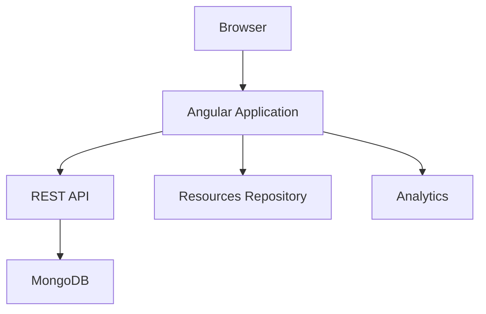

# Portfolio Sabrina — Frontend

<p align="center">
  <a href="https://sabrinacardoso.com" target="_blank">
    
  </a>
</p>

<p align="center">


</p>

---

## Overview

Portfolio Sabrina is a modern portfolio platform built with **Angular 19**, designed to provide a high-performance public experience while also offering a complete administrative interface for content management.

Instead of being a traditional landing page, the project was architected as a complete application with:

- Content Management
- Authentication
- REST API Integration
- Internationalization
- Analytics
- SEO
- Progressive Web App support
- Media Repository
- Administrative Dashboard

The project is part of a three-repository architecture:

| Repository | Responsibility |
|------------|----------------|
| portfolio-sabrina-frontend | Angular Application |
| portfolio-sabrina-backend | REST API |
| portfolio-sabrina-resources | Images, files and static resources |

---

# Live Application

Production

https://sabrinacardoso.com

Backend

https://portfolio-sabrina-backend.vercel.app

Repositories

Frontend

https://github.com/marinellibr/portfolio-sabrina-frontend

Backend

https://github.com/marinellibr/portfolio-sabrina-backend

Resources

https://github.com/marinellibr/portfolio-sabrina-resources

---

# Features

## Public Area

- Portfolio homepage
- About page
- Projects gallery
- Project details
- Contact section
- Resume download
- Multi-language support
- SEO metadata
- Open Graph
- Twitter Cards
- Responsive layout

---

## Administrative Area

Protected by JWT authentication.

Includes:

- Dashboard
- Project editor
- Create project
- Update project
- Delete project
- Image selector
- Media browser
- Automatic resource integration

---

## Analytics

The application includes a complete analytics layer capable of collecting:

- Sessions
- Screen Views
- Route Duration
- Click Events
- HTTP Performance
- UTM Parameters
- Referrer
- Campaign Information
- Navigation Timing

Unlike Google Analytics integration scattered across components, all analytics logic is centralized inside dedicated services.

---

# Architecture

```text
                Internet
                    │
                    ▼
        ┌────────────────────┐
        │ Angular Frontend   │
        └─────────┬──────────┘
                  │ REST
                  ▼
        ┌────────────────────┐
        │ Express Backend    │
        └─────────┬──────────┘
                  │
                  ▼
             MongoDB Atlas


Static Resources

GitHub Repository

portfolio-sabrina-resources

Images
Documents
Resume
Media
```

---

# High Level Design



---

# Technology Stack

## Frontend

- Angular 19
- TypeScript
- RxJS
- SCSS
- Angular Router
- Standalone Components
- Angular Service Worker
- ngx-translate

---

## Development

- Angular CLI
- Karma
- Jasmine
- ESLint
- Prettier

---

## External Services

- REST API
- MongoDB Atlas
- GitHub Resources Repository

---

# Folder Structure

```
src/

app/

components/

pages/

services/

models/

guards/

interceptors/

pipes/

directives/

shared/

core/

assets/

environments/

public/

i18n/
```

---

# Routing

Public Routes

```
/

about

projects

project/:id

contact

login
```

Protected Routes

```
admin

admin/post-editor

post-editor/:id
```

Administrative routes use an AuthGuard and require a valid JWT.

---

# Authentication Flow

```text
Login Page

↓

Backend Authentication

↓

JWT

↓

Browser Storage

↓

HTTP Interceptor

↓

Protected Endpoints
```

JWT injection happens automatically using an HTTP interceptor.

Components never manipulate authentication tokens directly.

---

# Internationalization

The application supports:

Portuguese

English

Translations are loaded dynamically using ngx-translate.

```
public/

i18n/

pt.json

en.json
```

The project content itself is multilingual.

Projects contain localized:

Title

Description

Call to Action

Metadata

instead of translating only UI labels.

---

# API Integration

The frontend communicates with the backend using REST endpoints.

Two different representations of a Project exist.

Gallery

Only essential information

Title

Cover

Slug

Summary

Details

Complete content

Gallery

Description

Links

Metadata

Media

This avoids downloading unnecessary data for listing pages.

---

# Administrative Editor

Instead of editing JSON files manually, the project provides a complete visual editor.

Features

Create projects

Edit projects

Delete projects

Image selection

Preview

Automatic validation

The editor was designed to behave similarly to a lightweight CMS.

---

# Media Repository

Large assets are intentionally separated from the frontend.

Reasons

Independent publishing

Repository size reduction

Versioned media

Editorial workflow

Better cache strategy

Instead of embedding large files into Angular assets, they are loaded from the Resources repository.

---

# Analytics Architecture

Analytics is one of the core architectural components.

Collected Events

Page View

Click

Navigation

Session

HTTP Timing

Campaign

Source

Medium

Referrer

UTM

```
User

↓

Analytics Service

↓

Tracking Queue

↓

Backend
```

The application also records the time spent on each route using the browser PageHide event.

This allows measuring the last visited page even if the browser is closed.

---

# SEO

Implemented features

Open Graph

Twitter Cards

Dynamic Title

Dynamic Description

Canonical URL

Localized metadata

Sharing images

Social Preview

---

# Progressive Web App

The application enables Angular Service Worker in production.

Benefits

Offline cache

Asset versioning

Faster loading

Background updates

Better Lighthouse score

---

# Performance Decisions

Several architectural decisions were made to improve performance.

Standalone Components

Lazy Loading

Tree Shaking

Service Worker

HTTP Interceptors

Optimized API Responses

Split Gallery/Detail endpoints

Translation lazy loading

Media Repository separation

Bundle hashing

---

# Security

Authentication via JWT

HTTP Interceptors

Protected Routes

Helmet

CORS

Rate Limiting

Input Validation

Request IDs

Logging Redaction

Secure Headers

Although some protections belong to the backend, the frontend was designed to integrate with all of them.

---

# Development

Clone

```bash
git clone https://github.com/marinellibr/portfolio-sabrina-frontend.git
```

Install

```bash
npm install
```

Run

```bash
npm start
```

Build

```bash
npm run build
```

Production

```bash
npm run build --configuration production
```

Test

```bash
npm test
```

---

# Environment

Development

```ts
export const environment = {

production: false,

apiUrl: "http://localhost:3000"

}
```

Production

```ts
export const environment = {

production: true,

apiUrl: "https://portfolio-sabrina-backend.vercel.app"

}
```

---

# Development Principles

This project follows some architectural guidelines.

- Components should remain presentation-focused.
- Business logic belongs to services.
- HTTP requests should not be performed inside components.
- Analytics should remain centralized.
- Translation strings must never be hardcoded.
- Administrative routes must always remain protected.
- API contracts should be represented by TypeScript models.
- Static assets should stay outside the application bundle whenever possible.

---

# Future Improvements

- Unit tests expansion
- E2E tests
- Image optimization pipeline
- Automatic sitemap generation
- Dark mode
- Accessibility improvements
- Content versioning
- Incremental Static Generation
- Better editor preview
- Search engine

---

# Related Projects

Backend

https://github.com/marinellibr/portfolio-sabrina-backend

Resources

https://github.com/marinellibr/portfolio-sabrina-resources

---

# Author

Luiz Marinelli

Senior Frontend Engineer

GitHub

https://github.com/marinellibr

LinkedIn

https://linkedin.com/in/luizmarinelli

---

# Acknowledgements

This project was developed using modern frontend engineering practices together with AI-assisted development workflows.

Artificial Intelligence was used to accelerate repetitive implementation tasks, documentation, refactoring and experimentation.

Architecture decisions, system design, API contracts, performance optimization, analytics strategy and engineering decisions remained human-driven throughout the project.

---

MIT License
